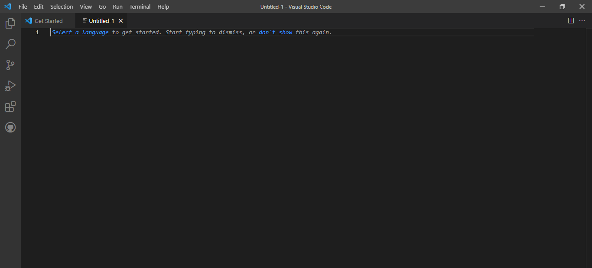
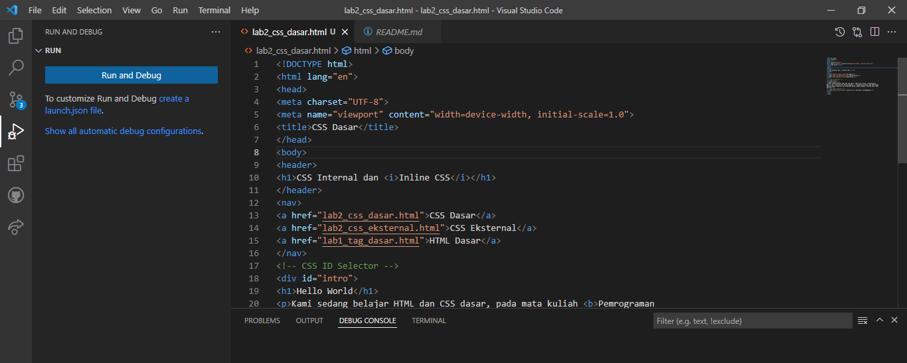
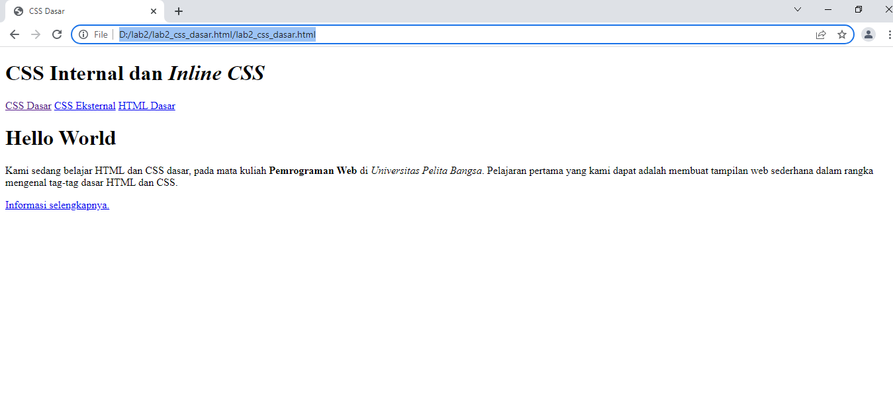
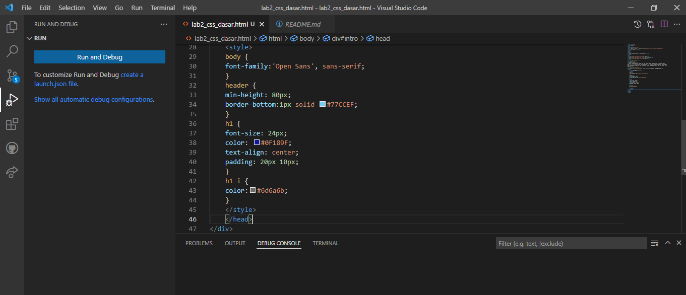
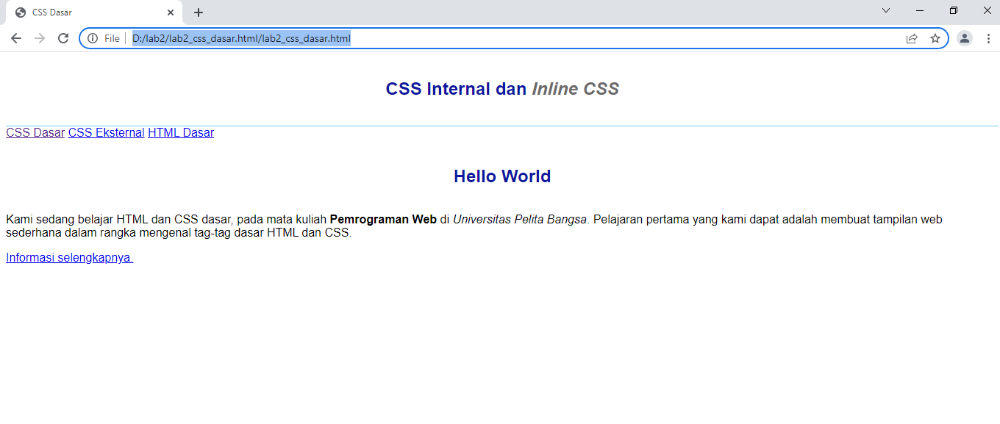
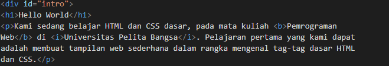
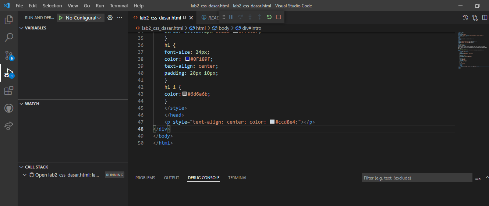

# Tugas lab2 CSS Dasar HTML  
## Nama: Nahrul Wijaya
## Nim: 312010415
## Kelas: TI.20.A1

# Langkah-Langkah Praktekum 
membuat text editor,saya menggunakan sublime text

# 1.Membuat Dokumen HTML

Buka pada browser untuk melihat hasilnya

# 2.Mendeteksian CSS Internal

Simpan perubahan yanag ada,dan lakukan refresh pada browser untuk,melihat hasilnya

# 3.Menambahkan Inline CSS

tambahkan dekrasi Inline CSS pada tag 
 seperti berikut

Refresh kembali browser untuk melihat perubahannya

