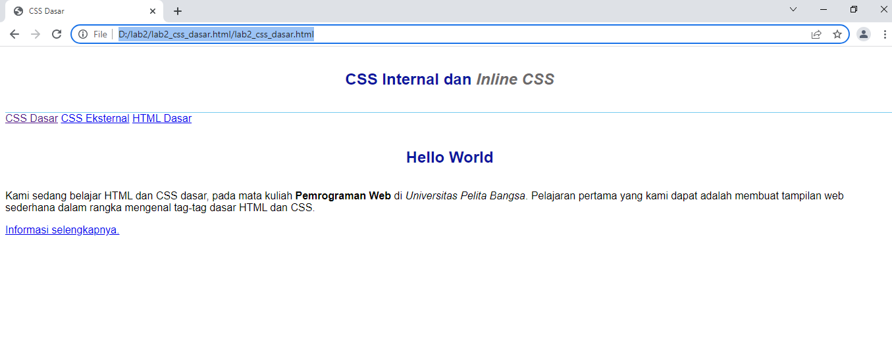
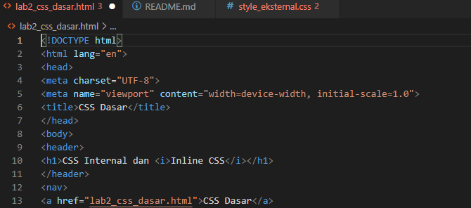
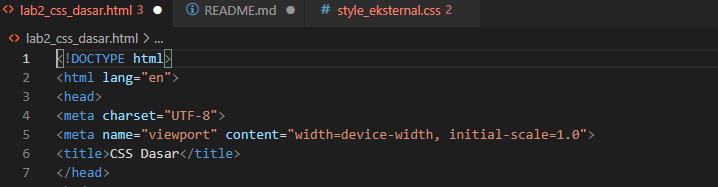
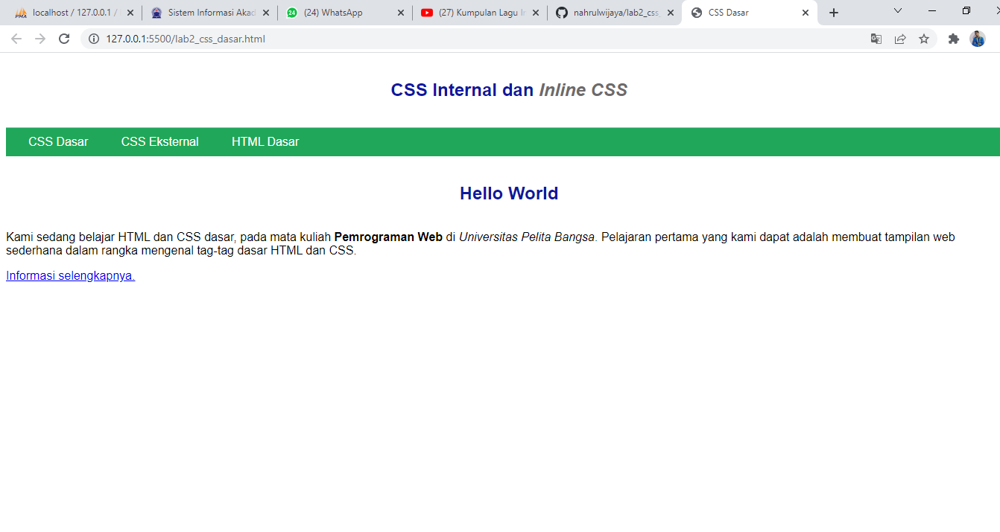
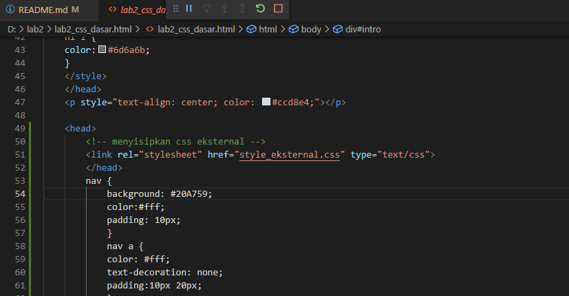
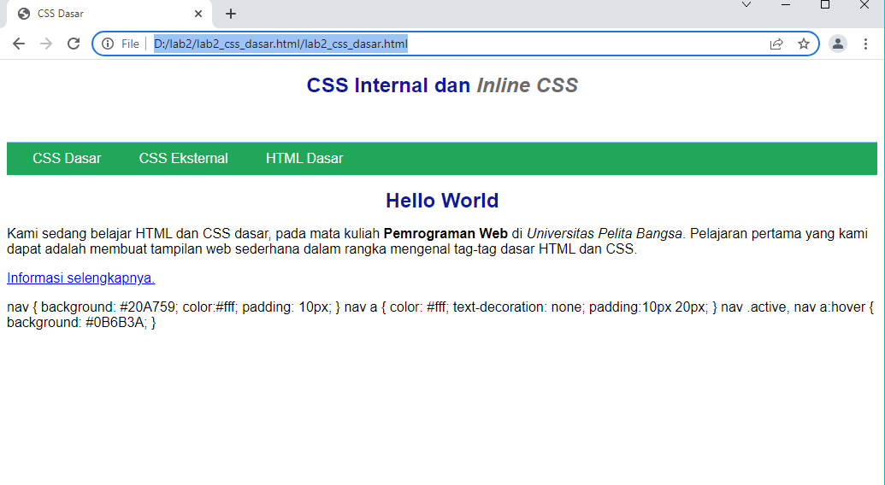

# Tugas lab2 CSS Dasar HTML  
## Nama: Nahrul Wijaya
## Nim: 312010415
## Kelas: TI.20.A1

# Langkah-Langkah Praktekum 
membuat text editor,saya menggunakan sublime text

# 1.Membuat Dokumen HTML

Buka pada browser untuk melihat hasilnya

# 2.Mendeteksian CSS Internal

Simpan perubahan yanag ada,dan lakukan refresh pada browser untuk,melihat hasilnya

# 3.Menambahkan Inline CSS

tambahkan dekrasi Inline CSS pada tag 
 seperti berikut

Refresh kembali browser untuk melihat perubahannya

# 4.Membuat CSS Eksternal

Buatlah file baru dengan nama style_eksternal.CSS seperti berikut

kemudian tambahkan tag <link> untuk merujuk file css yang sudah dibuat pada bagian <head>

Selanjutnya refresh kembali browser untuk melihat perubahannya.

# 5. Menambahkan CSS Selektor

Selanjutnya menambahkan Css Selector menggunakan ID dan Class Selector.pada file style_eksternal.css,tambahkan kode berikut.

kemudian simpan kembali dan refresh browser untuk melihat perubahannya

